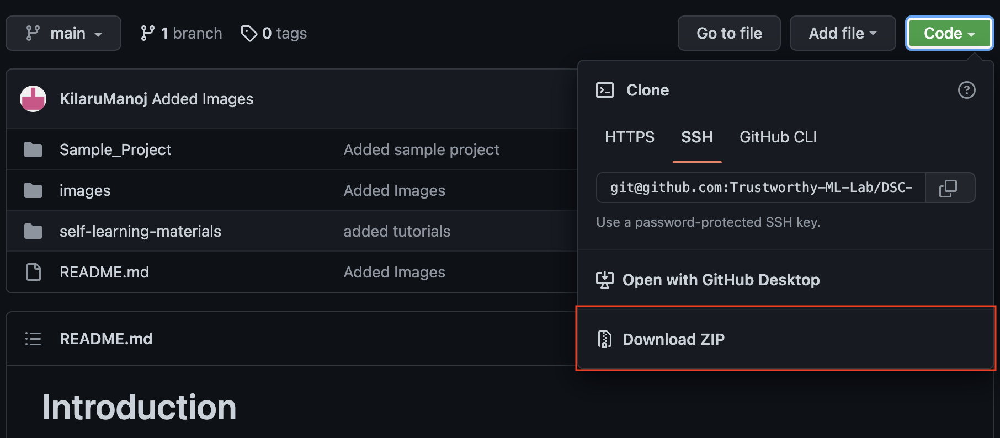

## Self learning notebooks
The notebooks in `self-learning-materials/` will help you get a quick review of basic programming skills needed for the course. The materials are originally authored by [Yash Khandelwal](https://github.com/yashskhandelwal). 

# Introduction
This repository contains a collection of materials for learning Python 3 (3.5+).

### Requirements
- Have Python 3.5 or newer installed. You can check the version by typing python3 --version in your command line. You can download the latest Python version from [here](https://www.python.org/downloads/).
- Have [Jupyter Notebook installed](http://jupyter.readthedocs.io/en/latest/install.html).

### Usage
1. Clone or download this repository.
2. Run `jupyter notebook` command in your command line in the repository directory.
3. Jupyter Notebook session will open in the browser and you can start navigating through the materials.

How to download this tutorial?

1. Click the big green "Code" button in the top right of
    the page, then click "Download ZIP".

    

2. Extract the ZIP and open it. Unfortunately I don't have any more
    specific instructions because how exactly this is done depends on
    which operating system you run.

If you have git and you know how to use it, you can also clone the
repository instead of downloading a zip and extracting it. An advantage
with doing it this way is that you don't need to download the whole
tutorial again to get the latest version of it, all you need to do is to
pull with git.
